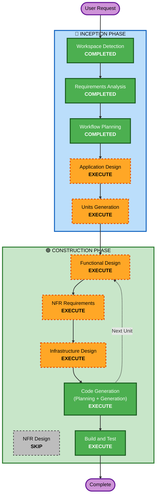

# Execution Plan

## Detailed Analysis Summary

### Change Impact Assessment
- **User-facing changes**: Yes — 新規Webアプリケーション全体の構築
- **Structural changes**: Yes — フルスタックアーキテクチャの新規設計
- **Data model changes**: Yes — ユーザー、服、予定、着用履歴のデータモデル新規作成
- **API changes**: Yes — REST APIの新規設計（認証、クローゼット、天気、提案）
- **NFR impact**: Yes — パフォーマンス、レスポンシブUI、AWS基盤

### Risk Assessment
- **Risk Level**: Medium
- **Rollback Complexity**: Easy（新規プロジェクト、既存システムへの影響なし）
- **Testing Complexity**: Moderate（外部API連携、AI統合あり）

## Workflow Visualization



### Text Alternative
```
Phase 1: INCEPTION
  - Stage 1: Workspace Detection (COMPLETED)
  - Stage 2: Requirements Analysis (COMPLETED)
  - Stage 3: User Stories (SKIPPED)
  - Stage 4: Workflow Planning (COMPLETED)
  - Stage 5: Application Design (EXECUTE)
  - Stage 6: Units Generation (EXECUTE)

Phase 2: CONSTRUCTION (per unit)
  - Stage 7: Functional Design (EXECUTE)
  - Stage 8: NFR Requirements (EXECUTE)
  - Stage 9: NFR Design (SKIP)
  - Stage 10: Infrastructure Design (EXECUTE)
  - Stage 11: Code Generation (EXECUTE)
  - Stage 12: Build and Test (EXECUTE)
```

## Phases to Execute

### 🔵 INCEPTION PHASE
- [x] Workspace Detection (COMPLETED)
- [x] Requirements Analysis (COMPLETED)
- [x] User Stories (SKIPPED — ハッカソン2-3日、ユーザーが選択しなかった)
- [x] Workflow Planning (COMPLETED)
- [x] Application Design (COMPLETED)
- [x] Units Generation (COMPLETED)

### 🟢 CONSTRUCTION PHASE (per unit)
- [ ] Functional Design - **EXECUTE**
  - **Rationale**: データモデル（ユーザー、服、予定）、AI提案ロジック、TPO判定ルールの詳細設計が必要
- [ ] NFR Requirements - **EXECUTE**
  - **Rationale**: パフォーマンス要件、技術スタック選定の確認が必要
- [ ] NFR Design - **SKIP**
  - **Rationale**: ハッカソンプロトタイプ、NFRパターンの詳細設計は不要。NFR Requirementsで十分
- [ ] Infrastructure Design - **EXECUTE**
  - **Rationale**: AWSインフラ（Lambda, DynamoDB, S3, Bedrock, API Gateway）の設計が必要
- [ ] Code Generation - **EXECUTE** (ALWAYS)
  - **Rationale**: 実装計画の策定とコード生成が必須
- [ ] Build and Test - **EXECUTE** (ALWAYS)
  - **Rationale**: ビルド・テスト・検証手順の策定が必須

### 🟡 OPERATIONS PHASE
- [ ] Operations - PLACEHOLDER

## Success Criteria
- **Primary Goal**: 2-3日以内に「今日の人格、着せておきました。」のMVPデモ可能な状態を実現
- **Key Deliverables**:
  - レスポンシブWebアプリケーション（Next.js）
  - バックエンドAPI（FastAPI on AWS）
  - AI服装提案機能（Amazon Bedrock/Claude）
  - クローゼット管理・天気取得・Google Calendar連携
- **Quality Gates**:
  - ユーザー登録・ログインが動作する
  - 服を登録して提案を受けられる
  - 天気とカレンダーの情報が反映された提案が出る
